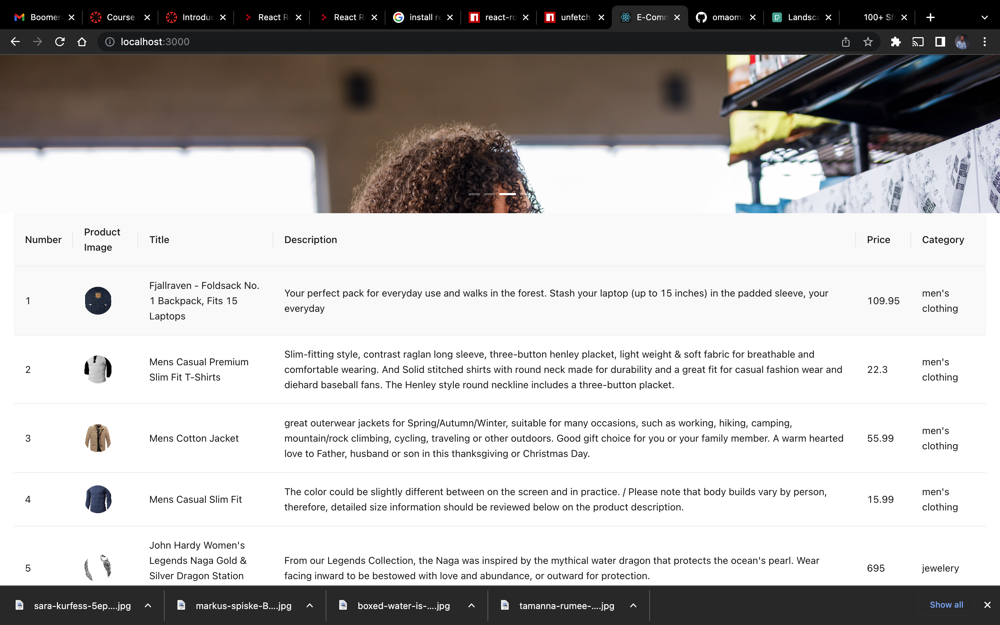
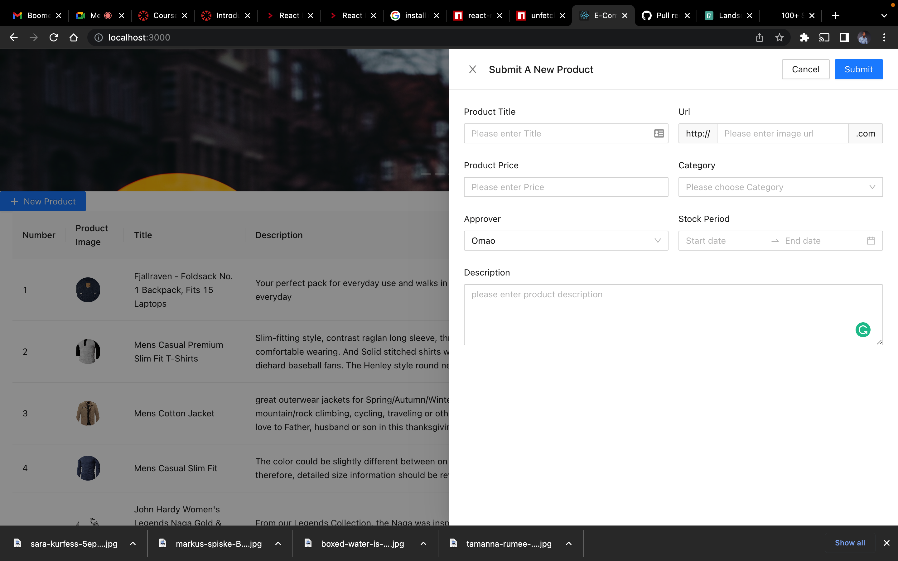

# Getting Started with Create React App

This is an ecommerce react projects

## Key installations

### 1. $ npm i unfetch
This allows you to use proxy, hiding the api, and just using the endpoints. 
### 2. $ npm install antd
for using the ant.design component features

# Admin Products Board
### products list table

### products list table 

